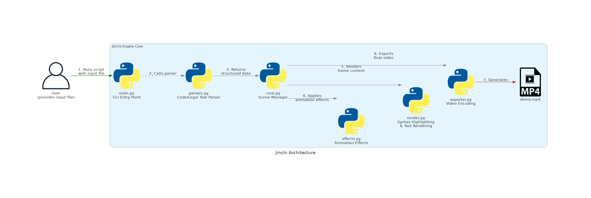
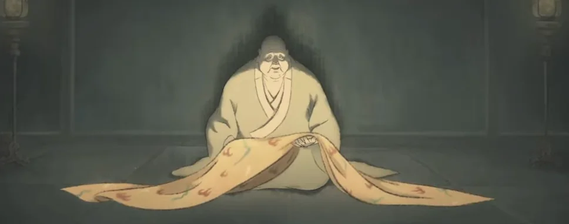

[](https://github.com/gongahkia/jinchi/releases/tag/1.0.0) 

# `Jinchi`

The poor man's [Manim](https://www.manim.community/).

`Jinchi` generates animations for [Source Code](https://www.geeksforgeeks.org/what-is-a-code-in-programming/) and [Legalese](https://www.merriam-webster.com/dictionary/legalese). It can be interfaced with through API calls via [Flask](#flask-backend) and [Django](#django-backend) servers, or run directly as a [local script](#direct-script).

## Stack

* *Backend*: [Python](https://www.python.org/)
* *Framework*: [Flask](https://flask.palletsprojects.com/en/stable/), [Django](https://www.djangoproject.com/)

## Usage

First run the below.

```console
$ git clone https://github.com/gongahkia/jinchi
$ cd jinchi
$ make
```

Then run any of the following.

### Flask Server

```console
$ cd flask-backend
$ python3 app.py
```

### Django Server

```console
$ cd django_backend
$ python3 manage.py runserver
```

### Direct Script Interaction

```console
$ cd src
$ python3 main.py program_code_example.py
$ python3 main.py legal_text_example.txt
```

## Architecture

### Flask Backend


### Django Backend


### Direct Script 



## Reference

The name `Jinchi` is in reference to [Elder Jinchi](https://blackmythwukong.fandom.com/wiki/Elder_Jinchi), a [Yaoguai King](https://blackmythwukong.fandom.com/wiki/Yaoguai_King) from [Chapter 1](https://www.rockpapershotgun.com/black-myth-wukong-chapter-1-walkthrough) of the 2024 game [Black Myth: Wukong](https://blackmythwukong.fandom.com/wiki/Black_Myth:_Wukong_Wiki), which is itself a reference to the [Jinchi Elder](https://villains.fandom.com/wiki/Jinchi_Elder), a minor antagonist who opposed [Sun Wukong](https://villains.fandom.com/wiki/Sun_Wukong_(Journey_to_the_West)) in the 16th-Century classic [Journey to the West](https://en.wikipedia.org/wiki/Journey_to_the_West).


